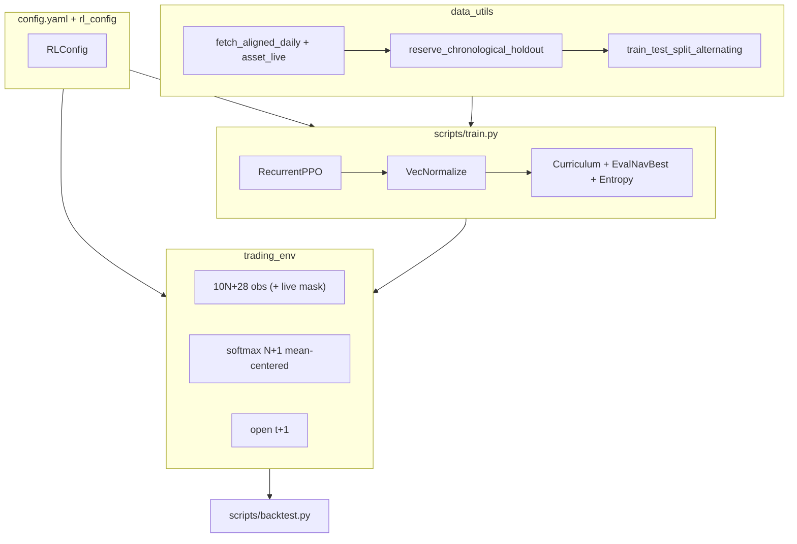

# MarketTrainer (RLBot)

Production research stack for training **RecurrentPPO** (LSTM) agents on a multi-asset daily portfolio environment, with strict chronological out-of-sample (OOS) holdouts and walk-forward in-training evaluation.

| Topic | Location |
|-------|----------|
| Hyperparameters, rewards, costs, curriculum | `config/config.yaml` → `rlbot/rl_config.py` |
| Universe size (5–55 assets), restart checklist | [docs/TRAINING.md](docs/TRAINING.md) |
| GPU training on Modal (live plots, volume sync) | [docs/MODAL.md](docs/MODAL.md) |
| Config field reference | [config/README.md](config/README.md) |
| Methodology & run results | [RESEARCH.md](docs/RESEARCH.md) |

Each training run writes under **`Runs/<run_id>/`** (manifest, config snapshot, models, plots, logs, TensorBoard). Paths are centralized in `rlbot/run_artifacts.py`.

---

## Quick start

```bash
python -m venv .venv && source .venv/bin/activate
pip install -e ".[dev]"

# After universe, fetch, or observation-panel changes (once)
python scripts/train.py --refresh-data --timesteps 1000 --run-id _data_refresh --no-viz

# Train (new run id per experiment; or --window N for W{N}_MMDD)
python scripts/train.py --timesteps 65000000 --window 1 \
  --train-end 2015-12-31 --holdout-start 2016-01-01 --holdout-end 2017-12-31 --until 2017-12-31

# OOS backtest on chronological holdout (never seen in training)
python scripts/backtest.py --run-id W1_604 --checkpoint best --detailed --stochastic-paths 30 --plot-tag best
```

**CLI entry points** (after `pip install -e .`): `market-trainer-train`, `market-trainer-backtest`.

**Modal (optional):** GPU training with the same `Runs/<run_id>/` layout. See [docs/MODAL.md](docs/MODAL.md).

```bash
pip install -e ".[modal]" && modal setup

# Train window 2 on H100 (broker scales n_envs + batch_size)
modal run scripts/modal_app.py -- \
  --modal-gpu H100 --window 2 --run-id W2_605 --timesteps 65000000 \
  --refresh-data --since 2006-01-01 --train-end 2017-12-31 \
  --holdout-start 2018-01-01 --holdout-end 2019-12-31 --until 2019-12-31

# Watch plot locally (IDE: Runs/<id>/plots/training.png)
python scripts/modal_app.py sync --run-id W2_605 --watch

# After training: pull models, logs, config snapshot, etc.
python scripts/modal_app.py sync --run-id W2_605 --pull-all
```

Use `--refresh-data` (or `modal run scripts/modal_app.py::upload_cache`) when a window needs OHLCV past the prior window’s `--until` clip on the shared `rlbot-cache` volume.

**Walk-forward batch backtest:**

```bash
python scripts/backtest.py --run-ids W1_604,W2_604 --checkpoint best
```

(`--checkpoint latest|both` evaluates non-ex-ante weights on the holdout and prints an OOS-touch warning; `best` is the published metric.)

**Universe:** `N = len(universe.assets)` in config, or `python scripts/train.py --n-assets N` (first N YAML keys). Do not change core hyperparameters across walk-forward cohorts unless starting a new study.

**Artifacts** (gitignored): `Runs/`, `.cache/data_cache.npz`. Legacy roots (`models/`, `runs/`, …) are still **read** until you run `python scripts/migrate_runs_layout.py`.

First launch in a new terminal can take several minutes before PPO progress appears; see [docs/TRAINING.md#startup-time-first-run-in-a-session](docs/TRAINING.md#startup-time-first-run-in-a-session).

---

## Architecture



---

## Core design

### Data (`rlbot/data_utils.py`)

1. Fetch aligned daily OHLCV for `universe.assets` (yfinance; HY OAS via FRED / proxy).
2. Cache panel, `tickers`, and **`asset_live`** (1 = real print, 0 = pre-IPO / missing) in `.cache/data_cache.npz` — **no global `dropna`** on the calendar.
3. Reserve chronological OOS holdout before any in-training split.
4. Walk-forward alternating split (126-bar blocks; every 4th block eval); precomputed `WalkforwardEnvPack` panels aligned per segment.
5. Features (RSI, MACD, fracdiff, trend) are strictly causal and the holdout is reserved first, so neither mode leaks OOS data. `data.feature_split_mode` controls how block features are built:
   - `continuous` (default): features computed once on the contiguous panel and **sliced** into blocks. Eval-block indicator memory is continuous with adjacent train blocks (matches the continuous backtest) — treat in-training eval NAV as a model-*selection* signal, not an independent estimate.
   - `independent`: features recomputed per segment over a causal preroll window (`data.feature_preroll_bars`, default 252) so slow indicators get real warmup; only panel-head bars without preroll history are neutralized (`data.feature_purge_warmup`).

### Environment (`rlbot/trading_env.py`)

- **Action:** `N+1` logits → optional EMA smoothing (`action_smoothing_alpha: 0.15`) → mean-centered softmax → long-only risky weights, per-asset cap; pre-IPO names forced to zero weight via `asset_live`.
- **Observation:** `obs_dim = 10×N + 28` (market features + per-asset live mask + portfolio state + four macro series).
- **Execution:** decide after `close[t−obs_lag]`, fill `open[t+1]`, MTM `close[t+1]`; holding costs deducted on pre-rebalance units at `close[t]`.
- **Episodes:** `max_episode_steps: 252` on training envs (full walk-forward segment on eval).

#### Reward & penalties (`config.yaml` → `reward`)

Per-step reward is a sum of shaped terms (logged to TensorBoard as `rew_decomp/*`):

| Term | Formula (reward units) | Config knobs |
|------|------------------------|--------------|
| **Return** | `clip(log_ret, −0.12, +0.06) × reward_scale` | `reward_scale: 2000` |
| **Sortino diff** | `clip(agent_sortino − bench_sortino, ±3) × risk_bonus_scale` after `sortino_min_steps: 20` over `risk_window: 63`; downside deviation floored at `sortino_downside_floor: 0.001` (10 bp/day) so no-loss windows cannot saturate the clip | vs `benchmark_cap_weights` passive book |
| **Participation** | `gross_exposure × participation_bonus × participation_reward_scale` | `0.05 × 20` |
| **Inactivity** | `cash_frac × inactivity_penalty_over_50` + extra linear ramp above 90% cash | `10.0` base, `15.0` above 90%; eval uses `eval_inactivity_penalty_scale: 0.05` |
| **Churn** | `turnover_frac × churn_penalty × VIX_mult × curriculum_churn_scale` | `churn_penalty: 8.5`; VIX mult clipped to **75–150%** of baseline 18 |
| **Drawdown** | `(dd_frac)² × drawdown_penalty_scale × drawdown_quadratic_multiplier` | `25 × 12` |

`turnover_frac` is dollar turnover ÷ NAV (e.g. 0.10 = 10% of NAV rebalanced that step). Churn is **off** early in training (`curriculum.churn_start_fraction`), then ramps linearly over 10M steps. Training applies fee/churn/obs-lag curricula; OOS backtest uses full fees, `churn_scale = 1`, fixed `obs_lag`.

#### Transaction costs (`config.yaml` → `transaction_costs`)

Per-asset **slippage**, **tx_fee**, and **annual_holding_cost** (length-N lists, same key order as `universe.assets`). Applied as `fee_scale ×` configured costs during training (curriculum starts at `fee_scale = 0`); backtest uses `fee_scale = 1`. Example defaults (SP500 … EEM): slippage 1–8 bps, tx fees 0.5–10 bps, holding costs 0–83 bps annualized (converted per bar).

### Training (`scripts/train.py`)

- **RecurrentPPO** `MlpLstmPolicy` (2×64 LSTM, MLP [128,128]), 16 parallel envs (local default), 65M timesteps (`n_steps: 4096`, `batch_size: 16384`, `n_epochs: 3`).
- **Rollout / optimization:** `n_steps × n_envs = 65,536` steps per PPO pause → 4 mini-batches/epoch × 3 epochs = **12** backprop passes (down from 80 with the prior 4096 batch × 5 epochs setup).
- **EvalNavBestModelCallback** → `Runs/<run_id>/models/best/best_model.zip` (max mean in-training eval NAV across **one deterministic rollout per eval segment**).
- **TradingCurriculumCallback** — fee-free phase, fee ramp, churn ramp, progressive domain randomization (milestones from `config.yaml` → `curriculum`).
- **AdaptiveEntropyCallback** — cosine entropy decay (not eval-gated).
- **Cadence:** eval every **500k** global steps (`eval_freq = 500_000 // n_envs`); training plot refresh `viz_freq: 500_000`; weight checkpoints every **1M** steps.
- Published OOS checkpoint rule: **eval-NAV-best only** (holdout never used to pick weights). `best_model.zip` is saved together with the VecNormalize stats it was selected under.
- **Early stop (opt-in):** `training.early_stop_patience > 0` stops after K evals with no new best NAV once the curriculum completes; the reason lands in the manifest.
- **Reproducibility (opt-in):** `training.reproducible: true` switches to deterministic per-env seed streams so same-seed runs reproduce (default keeps stochastic episode resets for diversity).
- **Run ids:** `--window N` → `W{N}_<month><day>` (e.g. `W1_604`); auto-id collisions get `_a`, `_b`, … Reusing an explicit `--run-id` that already has a manifest is refused unless `--overwrite-run` (or `--resume`) is passed.

### Evaluation

| Script | Purpose |
|--------|---------|
| `scripts/backtest.py` | OOS rollout from `Runs/<id>/manifest.json`, benchmarks, stochastic-path fan plot; writes `Runs/<id>/backtest_summary.json` with config/data hashes + drift warnings |
| `scripts/research.py` | Auto-research loop: `plan`/`launch`/`collect`/`report`/`promote` over `specs/*.yaml`; OOS firewall via tiers + `Runs/<cohort>/registry.jsonl` |
| `scripts/infer_weights.py` | Audited target weights for a run + as-of date (full provenance; no broker) |
| `scripts/paper_trade.py` | Measurement-only paper-trading helper over `infer_weights` outputs |
| `scripts/run_seed_ensemble.sh` | Multi-seed training + ensemble backtest |
| `scripts/migrate_runs_layout.py` | Move legacy `models/`, `plots/`, … into `Runs/<id>/` |
| `rlbot/baselines.py` | SPY B&H, equal-weight, 60/40, naive risk parity |
| `rlbot/inference_load.py` | VecNormalize + RecurrentPPO load helpers for backtest |

`backtest.py` loads weights via `inference_load`, runs a deterministic holdout rollout, optional **N stochastic paths** (`--stochastic-paths`, policy sampling), and saves `Runs/<id>/plots/backtest_<tag>.png` (individual paths + 5–95% fan). Use `--checkpoint best|latest|both`.

**Cross-window check** (e.g. W1 weights on W2 holdout): override holdout dates **and** extend `--until` past the new holdout — manifest `until` otherwise clips the cache too early:

```bash
python scripts/backtest.py --run-id W1_604 --checkpoint latest \
  --until 2019-12-31 --train-end 2017-12-31 \
  --holdout-start 2018-01-01 --holdout-end 2019-12-31 \
  --stochastic-paths 30 --detailed --plot-tag w2_cross
```

Passive benchmarks use **simple-return** cross-sectional aggregation, then compound (see `rlbot/baselines.py`).

---

## Walk-forward windows

Calendar flags are passed on `train.py` / `scripts/modal_app.py` and stored in `Runs/<run_id>/manifest.json`. Use `--window` or an explicit `--run-id` per cohort.

The canonical window table (enforced for research specs by `rlbot/research/spec.py:CANONICAL_WINDOWS`): window *N* trains through Dec-31 of `2013 + 2N` and holds out the following two calendar years.

| Window | Train through | OOS holdout | Example `run_id` |
|--------|---------------|-------------|------------------|
| 1 | 2015-12-31 | 2016–2017 | `W1_605` (current); `W1_604` (legacy local) |
| 2 | 2017-12-31 | 2018–2019 | `W2_605` |
| 3 | 2019-12-31 | 2020–2021 | `W3_605` |
| 4 | 2021-12-31 | 2022–2023 | `W4_605` |
| 5 | 2023-12-31 | 2024–2025 | `W5_605` |
| 6 | 2025-12-31 | 2026–2027 | `W6_605` |

Exact `--train-end` / `--holdout-*` / `--until` lines, Modal commands, and OOS results: [docs/RESEARCH.md](docs/RESEARCH.md#walk-forward-registry).

```bash
python scripts/backtest.py --run-id W1_604 --checkpoint best --detailed
```

---

## Project layout

| Path | Role |
|------|------|
| `config/config.yaml` | Universe, PPO, reward, costs, curriculum |
| `rlbot/` | Library: `data_utils`, `trading_env`, `rl_config`, `run_artifacts`, `inference_load`, `visualize`, `baselines`, `modal_cloud`, `research/` (spec/gates/registry/report) |
| `scripts/` | `train.py`, `backtest.py`, `research.py`, `infer_weights.py`, `paper_trade.py`, `modal_app.py` (Modal train + sync), `run_seed_ensemble.sh`, `migrate_runs_layout.py` |
| `specs/` | Pre-registered experiment specs for the auto-research loop |
| `Runs/<run_id>/` | `manifest.json`, `config.yaml`, `models/`, `plots/`, `logs/`, `tb_logs/`, `eval_logs/` |
| `paper_trade/` | Measurement-only paper-trade docs (no broker integration) |
| `docs/TRAINING.md` | Local operations guide |
| `docs/MODAL.md` | Modal setup, GPU broker, watch/pull workflow |
| `docs/RESEARCH.md` | Methodology + completed-run results |
| `tests/` | `pytest` |

**Modal artifacts:** During cloud training, the full run tree lives on the `rlbot-runs` volume. Local `Runs/<id>/` is populated by `python scripts/modal_app.py sync` (`--watch` for plots only; `--pull-all` for models and everything else).

---

## Dependencies

`gymnasium`, `stable-baselines3`, `sb3-contrib`, `torch`, `pandas`, `numpy`, `yfinance`, `matplotlib`, `tensorboard`, `PyYAML` — see `requirements.txt` / `pyproject.toml`. Optional cloud: `pip install -e ".[modal]"` (`modal`, `fastapi`).
