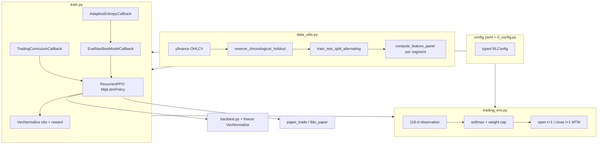

# MarketTrainer (RLBot)

Research codebase for training RecurrentPPO (LSTM) agents on a multi-asset daily portfolio environment, with strict chronological out-of-sample (OOS) holdouts and walk-forward in-training evaluation.

Hyperparameters, rewards, transaction costs, curriculum milestones, and data settings live in **`config.yaml`** (loaded by `rl_config.py`). Each training run snapshots that file to `runs/<run_id>/config.yaml` for reproducibility.

**Full OOS research report:** [RESEARCH.md](RESEARCH.md)

---

## Quick start

```bash
python -m venv .venv
source .venv/bin/activate
pip install -r requirements.txt
# or: pip install -e .

# 1. Fetch / refresh aligned daily panel (yfinance) and train (defaults from config.yaml)
python train.py --refresh-data

# 2. OOS backtest on the chronological holdout (never seen during training)
python backtest.py --run-id <RUN_ID> --detailed

# 3. Optional: regime / calendar sweep with explicit leakage labels
python backtest_sweep.py --run-id <RUN_ID>
```

**CLI entry points** (after `pip install -e .`): `market-trainer-train`, `market-trainer-backtest`.

Override hyperparameters without editing YAML: `python train.py --config path/to/config.yaml`. Date windows and `--run-id` always come from the CLI for walk-forward runs.

Artifacts: `models/`, `runs/`, `logs/`, `plots/`, `tb_logs/` (gitignored by default).

---

## Asset universe

The policy outputs 11 weights via softmax: **cash** + **10 tradeable assets** (long-only risky legs, 50% per-asset cap by default in `config.yaml`, clip-and-redistribute overflow). Macro series feed the observation vector only — they are **not** in the action space.

### Tradeable assets (in order)

| Label | Yahoo symbol | What it represents |
|-------|--------------|-------------------|
| SP500 | SPY | S&P 500 (also the OOS **benchmark** via `benchmark_ohlcv_index()`) |
| GOLD | GLD | Gold |
| OIL | USO | Crude oil (WTI) |
| EURUSD | EURUSD=X | EUR/USD FX |
| USDJPY | USDJPY=X | USD/JPY FX |
| NIKKEI | ^N225 | Nikkei 225 |
| FTSE | ^FTSE | FTSE 100 |
| BOND10Y | IEF | 10-year Treasury (ETF proxy) |
| COPPER | HG=F | Copper futures |
| EM | EEM | Emerging markets |

Defined in `data_utils.py` as `YF_SYMBOLS` / `TICKERS`.

### Macro features only (not traded)

| Label | Symbol | Role |
|-------|--------|------|
| DXY | DX-Y.NYB | US dollar index |
| TNX | ^TNX | 10-year Treasury yield |

**Macro (observation only):** DXY, TNX, VIX (^VIX), HY OAS (FRED `BAMLH0A0HYM2` where available, HYG/IEF proxy back-filled and calibrated). These feed fracdiff and vol in the **118-d** observation — not the action space.

---

## Architecture overview



---

## Configuration (`config.yaml`, `rl_config.py`)

| Section | Purpose |
|---------|---------|
| `environment` | Cash, episode length, `obs_lag`, weight cap, DR Beta params |
| `reward` | Scales, churn λ, drawdown / inactivity / participation |
| `transaction_costs` | Per-asset slippage, fees, annual holding cost (10 assets) |
| `hyperparameters` | PPO: LR, batch 16384, `n_steps` 32768, etc. |
| `policy` | 2×64 LSTM, MLP [128, 128] |
| `training` | 65M default timesteps, 8 envs, block/eval stride |
| `vec_normalize` | Obs/reward normalization clips |
| `entropy_schedule` | Explore / exploit entropy lifecycle |
| `curriculum` | Fee-free, ramp, churn, DR-widen fractions (65M / 120M anchors) |
| `data` | `fracdiff_d`, `feature_purge_warmup` (25 bars at segment joins) |

`train.py` calls `apply_deterministic_seeds()` and copies the resolved config into each run directory.

---

## Data pipeline (`data_utils.py`)

1. **Fetch & align:** Daily OHLCV outer-joined across assets; short forward-fill for holidays; rows before any asset’s first quote are dropped.
2. **Chronological holdout:** `reserve_chronological_holdout()` removes the OOS tail (explicit dates or `--holdout-days`) before any in-training split. Used only by `backtest.py`.
3. **Walk-forward split:** `train_test_split_alternating()` takes **raw** `ohlcv` + `macro` only. Timeline is split into **126-bar** blocks; every **4th** block is in-training eval.
4. **Per-segment features:** RSI, MACD, and fracdiff are computed with `compute_feature_panel()` on each contiguous train/eval **segment** so indicators never leak across block boundaries.
5. **Join purge:** The first **25** bars after each segment join are neutralized (RSI → 50, MACD/fracdiff → 0) per `feature_purge_warmup`.
6. **Fracdiff:** Vectorized `fracdiff_series_1d` (López de Prado-style, default **d = 0.4**).

---

## Environment (`trading_env.py`)

**Action:** `Box(-3, 3)^11` → softmax → **clip-and-redistribute** cap per risky asset (`max_single_asset_weight`, default **50%**).

**Observation (118 dimensions):**

| Block | Count | Description |
|-------|------:|-------------|
| Fracdiff increments | 40 | Horizons 1, 5, 10, 20 × 10 assets |
| Market mean fracdiff | 4 | Mean increment per horizon |
| Realized volatility | 10 | 20-day std of log returns per asset |
| Market mean vol | 1 | Mean vol across assets |
| RSI | 10 | Scaled ≈ [-1, 1] |
| MACD | 10 | tanh-compressed |
| EMA trend distance | 10 | (EMA20 − EMA100) / EMA100 per asset, clipped |
| Macro (DXY, TNX, VIX, HY OAS) | 20 | Fracdiff horizons + vol |
| Portfolio weights | 11 | Cash + 10 assets |
| Meta | 2 | Drawdown from episode peak, episode progress |

**Execution (causal):**

1. Features at bar `t` use data through `close[t - obs_lag]` (`obs_lag` ∈ {0,1,2} under training DR; **1** in OOS backtest).
2. Rebalance at **`open[t+1]`**.
3. Holding costs applied on **`close[t+1]`** after the rebalance; mark-to-market at **`close[t+1]`**.

**Reward:**

```
reward = REWARD_SCALE × clipped_log_return
       + RISK_BONUS_SCALE × (agent_sortino - cap_weighted_benchmark_sortino)   [21-day]
       + PARTICIPATION_BONUS × gross_exposure
       - inactivity penalties (cash > 50%, > 90%)
       - churn_scale × CHURN_LAMBDA × |Δw|    # CHURN_LAMBDA not scaled by REWARD_SCALE
       - (DRAWDOWN_PENALTY_SCALE × 10) × drawdown_from_peak²
```

Training-only: **domain randomization** (Beta-centered `fee_scale`, random `obs_lag`) after the fee curriculum releases DR; **churn_scale** ramps from 0 → 1 mid-curriculum.

---

## Training (`train.py`)

- **RecurrentPPO** (`MlpLstmPolicy`), **VecNormalize** on observations and training rewards.
- **TradingCurriculumCallback** (65M budget): frictionless ~**5.2M** steps (8%) → fee ramp to ~**22.75M** (35%) → progressive DR widen to ~**55.25M** → full DR; churn penalty from ~**9.75M** (15%).
- **EvalNavBestModelCallback:** saves `models/<run_id>/best/best_model.zip` on **maximum mean eval ending NAV** (not episodic reward); writes `eval_nav_history.npz`.
- **AdaptiveEntropyCallback:** high entropy early, then **mandatory** cosine decay to `final_ent` starting at **45%** of the run (`decay_start_fraction` in config), independent of eval NAV; eval improvements are logged only.
- Determinism: `torch.use_deterministic_algorithms`, cuDNN flags, seeded envs.

Outputs: `ppo_portfolio_final.zip`, `vec_normalize.pkl`, mirrored stats under `best/`, manifest + config under `runs/<run_id>/`.

---

## Evaluation & deployment

| Tool | Role |
|------|------|
| `backtest.py` | OOS rollout; plots model vs **SPY** and **equal-weight (10×10%)** buy-and-hold + target weights; freezes VecNormalize |
| `backtest_sweep.py` | Multiple calendar slices with leakage labels |
| `paper_trade/paper_trade.py` | Recent-panel inference (used by IBKR paper stack) |
| `ibkr_paper/` | Interactive Brokers paper rebalance driver |

```bash
# Latest (65M final) vs best (eval NAV peak)
python backtest.py --run-id 65M_W1_6_01_26 --until 2022-12-31 --plot-tag latest --detailed
# Writes plots/<run_id>/backtest_latest.png (3 rows: vs SPY + equal-weight, drawdowns, weights)
python backtest.py --run-id 65M_W1_6_01_26 --model models/65M_W1_6_01_26/best/best_model.zip --until 2022-12-31 --plot-tag best --detailed
```

Match holdout flags to the window used in training (see `windows/README.md`).

---

## Walk-forward windows

| Window | Train | OOS holdout | `--until` |
|--------|-------|-------------|-----------|
| **1** | 2006–2020 | 2021–2022 | `2022-12-31` |
| **2** | 2006–2022 | 2023–2024 | `2024-12-31` |
| **3** | 2006–2024 | last **365** days | *(omit)* |

Shell helpers: `windows/window{1,2,3}_train.sh`, `windows/validate_split.py`.

---

## Project layout

| Path | Role |
|------|------|
| `config.yaml` | Single source of truth for training defaults |
| `rl_config.py` | Typed loader, seeds, env alias sync |
| `data_utils.py` | Fetch, align, per-block features, splits, cache |
| `trading_env.py` | Gymnasium env, reward, execution |
| `train.py` | RecurrentPPO + callbacks |
| `backtest.py` / `backtest_sweep.py` | OOS evaluation |
| `vecnorm_utils.py` | Freeze VecNormalize for inference (`training=False`) |
| `tests/` | Pytest smoke tests (`pip install -e ".[dev]" && pytest`) |
| `run_artifacts.py` | Run IDs, paths, manifests |
| `visualize.py` | Training and backtest plots |
| `pyproject.toml` | Package `market_trainer` + CLI scripts |
| `windows/` | Walk-forward train/backtest scripts |
| `paper_trade/` | Live / paper inference |
| `ibkr_paper/` | IBKR execution wrapper |
| `RESEARCH.md` | OOS results and methodology |

---

## Dependencies

Core: `gymnasium`, `stable-baselines3`, `sb3-contrib`, `torch`, `pandas`, `numpy`, `yfinance`, `matplotlib`, `tensorboard`, `PyYAML`.

See `requirements.txt` or `pyproject.toml` for pinned minimum versions.
