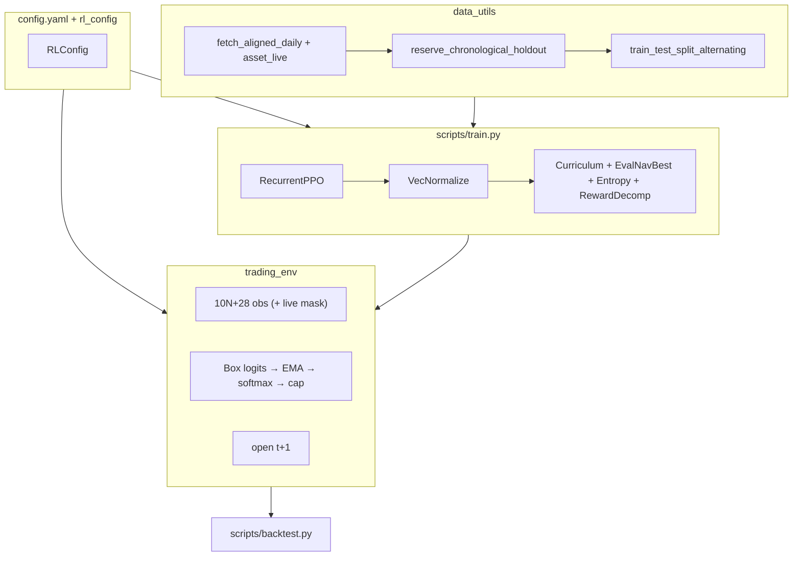

# MarketTrainer (RLBot)

Production research stack for training **RecurrentPPO** (LSTM) agents on a multi-asset daily portfolio environment, with strict chronological out-of-sample (OOS) holdouts and walk-forward in-training evaluation.

| Topic | Location |
|-------|----------|
| Hyperparameters, rewards, costs, curriculum | `config/config.yaml` → `rlbot/rl_config.py` |
| Universe size (5–55 assets), restart checklist | [docs/TRAINING.md](docs/TRAINING.md) |
| GPU training on Modal (live plots, volume sync) | [docs/MODAL.md](docs/MODAL.md) |
| Config field reference | [config/README.md](config/README.md) |
| Methodology & walk-forward protocol (OOS results pending) | [docs/RESEARCH.md](docs/RESEARCH.md) |
| Theoretical Auto-research loop implementable (spec → registry → report) | `scripts/research.py` · `specs/*.yaml` |

Each training run writes under **`Runs/<run_id>/`** (manifest, config snapshot, models, plots, logs, TensorBoard). Paths are centralized in `rlbot/run_artifacts.py`.

**OOS results:** The pipeline changed substantially since any prior backtests. There are **no definitive published results** under the current config/harness yet — see [docs/RESEARCH.md](docs/RESEARCH.md).

---

## Quick start

```bash

# Initialize virtual env and install dependencies
python -m venv .venv && source .venv/bin/activate
pip install -e ".[dev]"

# Create data cache and execute a small test run
python scripts/train.py --refresh-data --timesteps 1000 --run-id _data_refresh --no-viz

# Train (new run id per experiment; or --window N for W{N}_MMDD)
python scripts/train.py --timesteps 65000000 --window 1 \
  --train-end 2015-12-31 --holdout-start 2016-01-01 --holdout-end 2017-12-31 --until 2017-12-31

# OOS backtest on chronological holdout (after training completes; use your run id)
python scripts/backtest.py --run-id <RUN_ID> --checkpoint best --detailed --stochastic-paths 30 --plot-tag best
```

**CLI entry points** (after `pip install -e .`): `market-trainer-train`, `market-trainer-backtest`.

**Modal (optional):** GPU training with the same `Runs/<run_id>/` layout. See [docs/MODAL.md](docs/MODAL.md).

```bash
pip install -e ".[modal]" && modal setup

# Train on Modal (broker scales n_envs + batch_size; pass --run-id or use --window N)
modal run scripts/modal_app.py -- \
  --modal-gpu H100 --window 2 --run-id <RUN_ID> --timesteps 65000000 \
  --refresh-data --since 2006-01-01 --train-end 2017-12-31 \
  --holdout-start 2018-01-01 --holdout-end 2019-12-31 --until 2019-12-31

# Watch plot locally (IDE: Runs/<run_id>/plots/training.png)
python scripts/modal_app.py sync --run-id <RUN_ID> --watch

# After training: pull models, logs, config snapshot, etc.
python scripts/modal_app.py sync --run-id <RUN_ID> --pull-all
```

Use `--refresh-data` (or `modal run scripts/modal_app.py::upload_cache`) when a window needs OHLCV past the prior window’s `--until` clip on the shared `rlbot-cache` volume.

**Walk-forward batch backtest** (after each window is trained under the current config):

```bash
python scripts/backtest.py --run-ids <RUN_ID_1>,<RUN_ID_2>,<RUN_ID_3> --checkpoint best
```

**Universe:** `N = len(universe.assets)` in config, or `python scripts/train.py --n-assets N` (first N YAML keys). When changing **N**, run `--refresh-data` so the global cache matches; each run also snapshots the effective **N**-wide panel to `Runs/<id>/data_cache.npz`. Do not change core hyperparameters across walk-forward cohorts unless starting a new study.

**Artifacts** (gitignored): `Runs/`, `.cache/data_cache.npz`. Legacy roots (`models/`, `runs/`, …) are still **read** until you run `python scripts/migrate_runs_layout.py`.

First launch in a new terminal can take several minutes before PPO progress appears; see [docs/TRAINING.md#startup-time-first-run-in-a-session](docs/TRAINING.md#startup-time-first-run-in-a-session).

---

## Architecture



---

## Core design

### Data (`rlbot/data_utils.py`)

1. Fetch aligned daily OHLCV for `universe.assets` (yfinance; HY OAS via FRED / proxy).
2. Cache panel, `tickers`, and **`asset_live`** (1 = real print, 0 = pre-IPO / missing) in `.cache/data_cache.npz` — **no global `dropna`** on the calendar.
3. Reserve chronological OOS holdout before any in-training split.
4. Walk-forward alternating split (`training.block_size: 126`; `eval_stride: 4`); precomputed `WalkforwardEnvPack` panels aligned per segment.
5. Fractional differentiation (`data.fracdiff_d: 0.4`) on log prices; RSI, MACD, trend, realized vol.
6. Features via `data.feature_split_mode`: **`continuous`** (default — full-panel compute, slice per block) or **`independent`** (recompute per segment + `feature_purge_warmup: 25` neutralization). Holdout is always reserved first; neither mode leaks OOS data.

### Environment (`rlbot/trading_env.py`)

- **Policy output:** `Box(−3, 3)^(N+1)` raw logits (cash index 0 + N risky assets).
- **Action → weights:** optional EMA on logits (`action_smoothing_alpha: 0.15`, train + backtest) → **softmax** (cash competes with assets) → `asset_live` mask (pre-IPO weights zeroed) → per-asset cap (`max_single_asset_weight: 0.35`) with redistribute, then final cap projection to cash → long-only simplex (`portfolio_weights_from_action`).
- **Observation:** `obs_dim = 10×N + 28` = per-asset market block (fracdiff horizons, vol, RSI, MACD, trend) + **live mask** + portfolio weights + drawdown/progress + 4 macro series (DXY, TNX, VIX, HY OAS; macro is observe-only).
- **Execution:** features at `t` use `close[t−obs_lag]`; holding cost on pre-rebalance units at `close[t]`; rebalance fill `open[t+1]`; MTM `close[t+1]`.
- **Episodes:** `max_episode_steps: 252` on training envs; eval uses the full walk-forward segment. Terminates early if NAV ≤ `stop_loss_fraction` (0.45) × episode-start NAV.
- **Domain randomization (training):** after the fee curriculum releases, each episode resamples `obs_lag` ∈ {0,1,2} and `fee_scale` (Beta-mapped bell around 1.0); bounds widen progressively through the DR phase. Eval/backtest: fixed `obs_lag = 1`, `fee_scale = 1`, no DR.

#### Reward & penalties (`config.yaml` → `reward`)

Per-step reward (before VecNormalize during training):

`reward = return (with downside amp) + sortino_diff + participation − inactivity − churn`

Logged per term in `info` / TensorBoard as `rew_decomp/*` (including `rew_decomp/vix_churn_mult`):

| Term | Sign | Formula (reward units) | Config knobs |
|------|------|------------------------|--------------|
| **Return** | + | `clip(log_ret, −0.12, +0.06) × reward_scale`; negative returns × `(1 + drawdown_downside_gamma × dd_pre)` | `reward_scale: 2000`; `drawdown_downside_gamma: 5`; `dd_pre` = pre-step drawdown vs episode peak |
| **Sortino diff** | + | `clip(agent_sortino − bench_sortino, ±3) × risk_bonus_scale` after `sortino_min_steps: 20` over `risk_window: 63` | `risk_bonus_scale: 25`; benchmark uses `benchmark_cap_weights` with same friction model |
| **Participation** | + | `gross_exposure × participation_bonus × participation_reward_scale` | `0.05 × 20` |
| **Inactivity** | − | `cash_frac × inactivity_penalty_over_50` + extra linear ramp from 90%→100% cash | `1.5` + `1.0` tail (max ~2.5 at 100% cash) |
| **Churn** | − | `tx_cost_frac × churn_penalty × reward_scale × VIX_mult × curriculum_churn_scale` | `churn_penalty: 1.0` (multiplier on realized slippage+fees); `VIX_mult = clip(VIX/18, 0.75, 1.5)` |
| **Drawdown amp** | (in return) | Extra negative return when `log_ret < 0` and `dd_pre > 0`; logged as `rew_decomp/drawdown` | See `drawdown_downside_gamma` |

`tx_cost_frac` = realized slippage + fee dollars paid at rebalance ÷ NAV (zero when `fee_scale = 0`). Training `curriculum_churn_scale` is **0** during fee-free phase, then **0.1 → 1.0** over the **fee ramp** (`fee_free_fraction` → `fee_ramp_fraction`). OOS backtest: full fees, `churn_scale = 1`, fixed `obs_lag = 1`.

#### Transaction costs (`config.yaml` → `transaction_costs`)

Per-asset **slippage**, **tx_fee**, and **annual_holding_cost** (length-N lists, same key order as `universe.assets`). Applied as `fee_scale ×` configured costs during training (curriculum starts at `fee_scale = 0`); backtest uses `fee_scale = 1`. Example defaults (SP500 … EEM): slippage 1–8 bps, tx fees 0.5–10 bps, holding costs 0–83 bps annualized (converted per bar).

### Training (`scripts/train.py`)

- **RecurrentPPO** `MlpLstmPolicy` (2×64 LSTM, MLP [128,128]), 16 parallel envs (local default), 65M timesteps (`n_steps: 4096`, `batch_size: 16384`, `n_epochs: 3`, `gamma: 0.975`).
- **VecNormalize:** obs normalization on; reward normalization during training only (frozen at inference via `freeze_vec_normalize_for_inference`).
- **Rollout / optimization:** `n_steps × n_envs = 65,536` steps per PPO pause → 4 mini-batches/epoch × 3 epochs = **12** backprop passes.
- **LR:** cosine decay from `learning_rate: 3e-4` to `learning_rate_floor: 1e-6`.
- **EvalNavBestModelCallback** → `Runs/<run_id>/models/best/best_model.zip` (max mean in-training eval NAV across **one deterministic rollout per eval segment**); optional patience early-stop via `training.early_stop_patience` (after curriculum completes).
- **TradingCurriculumCallback** — fee-free phase, fee ramp, churn ramp, progressive domain randomization (milestones from `config.yaml` → `curriculum`).
- **AdaptiveEntropyCallback** — cosine entropy decay (not eval-gated).
- **RewardDecompCallback** — per-term reward balance to TensorBoard (`rew_decomp/*`) and `eval_logs/reward_decomp.json`.
- **Cadence:** eval every **500k** global steps (`eval_freq = 500_000 // n_envs`); training plot refresh `viz_freq: 500_000`; weight checkpoints every **1M** steps.
- OOS checkpoint rule (when reporting): **eval-NAV-best only** (holdout never used to pick weights).
- **Run ids:** `--window N` → `W{N}_MMDD` (month/day at launch, e.g. `W1_0608`); collisions get `_a`, `_b`, …; or pass `--run-id <RUN_ID>` explicitly.
- **Reproducibility:** default uses `reseed_on_reset` (stochastic episode starts); set `training.reproducible: true` for deterministic per-env seed streams.

### Evaluation & inference

| Script / module | Purpose |
|-----------------|---------|
| `scripts/backtest.py` | OOS rollout from `Runs/<id>/manifest.json`, benchmarks, stochastic-path fan plot; writes `backtest_summary.json` |
| `scripts/infer_weights.py` | Audited target weights for a single `--as-of` date (provenance-rich JSON; no broker) |
| `scripts/research.py` | Auto-research: `plan`/`launch`/`report` over `specs/*.yaml` with OOS-gated tiers |
| `scripts/run_seed_ensemble.sh` | Multi-seed training + ensemble backtest |
| `scripts/migrate_runs_layout.py` | Move legacy `models/`, `plots/`, … into `Runs/<id>/` |
| `rlbot/baselines.py` | Cash, benchmark-only B&H, equal-weight (daily + monthly, tx-cost-aware), 60/40, naive risk parity |
| `rlbot/inference_load.py` | VecNormalize + RecurrentPPO load helpers |
| `rlbot/inference_output.py` | Torch-free weight-payload assembly/validation |
| `rlbot/stats.py` | Block-bootstrap helpers for `--detailed` backtest stats |

`backtest.py` binds the run-local `config.yaml` and `data_cache.npz` by default, loads weights via `inference_load`, runs a deterministic holdout rollout, optional **N stochastic paths** (`--stochastic-paths`, policy sampling), and saves `Runs/<id>/plots/backtest_<tag>.png` (individual paths + 5–95% fan). Default `--checkpoint` is **`best`** (eval-NAV-selected); `latest`/`both` print an OOS-touch warning.

**Cross-window check** (optional; no published numbers yet): load window *N* weights on window *N+1* holdout by overriding holdout dates **and** extending `--until` past the new holdout — manifest `until` otherwise clips the cache too early:

```bash
python scripts/backtest.py --run-id <RUN_ID> --checkpoint best \
  --until 2019-12-31 --train-end 2017-12-31 \
  --holdout-start 2018-01-01 --holdout-end 2019-12-31 \
  --stochastic-paths 30 --detailed --plot-tag cross_window
```

Passive benchmarks use **simple-return** cross-sectional aggregation, then compound (see `rlbot/baselines.py`). OOS backtest requires VecNormalize by default (`--allow-missing-vec-normalize` for debug only). `best_model.zip` is paired with `best/vec_normalize.pkl` from the same eval step.

---

## Walk-forward windows used

Calendar flags are passed on `train.py` / `scripts/modal_app.py` and stored in `Runs/<run_id>/manifest.json`. Use `--window` or an explicit `--run-id` per cohort.

| Window | Train through | OOS holdout | Sample `run_id` |
|--------|---------------|-------------|------------------|
| 1 | 2015-12-31 | 2016–2017 | `W1_MMDD` |
| 2 | 2017-12-31 | 2018–2019 | `W2_MMDD` |
| 3 | 2019-12-31 | 2020–H1 2021 | `W3_MMDD` |
| 4 | 2021-06-30 | 2021 H2–2022 | `W4_MMDD` |
| 5 | 2022-12-31 | 2023–2024 | `W5_MMDD` |
| 6 | 2024-12-31 | 2025–latest | `W6_MMDD` |

`MMDD` = month and day at train launch; use `--window N` to auto-generate or `--run-id <RUN_ID>` for a custom id. Calendar flags, Modal commands, and the OOS results table (all pending): [docs/RESEARCH.md](docs/RESEARCH.md#walk-forward-status-results-pending).

```bash
python scripts/backtest.py --run-id <RUN_ID> --checkpoint best --detailed --stochastic-paths 30
```

---

## Project layout

| Path | Role |
|------|------|
| `config/config.yaml` | Universe, PPO, reward, costs, curriculum |
| `rlbot/` | Library: `data_utils`, `trading_env`, `rl_config`, `run_artifacts`, `inference_load`, `inference_output`, `vecnorm_utils`, `visualize`, `baselines`, `modal_cloud`, `stats`, `reward_logging`, `research/` |
| `scripts/` | `train.py`, `backtest.py`, `infer_weights.py`, `research.py`, `modal_app.py`, `run_seed_ensemble.sh`, `migrate_runs_layout.py` |
| `specs/` | Experiment specs for `research.py` (feature-split A/B, reward/curriculum ablations) |
| `Runs/<run_id>/` | `manifest.json`, `config.yaml`, `data_cache.npz`, `models/`, `plots/`, `logs/`, `tb_logs/`, `eval_logs/`, `backtest_summary.json` |
| `docs/TRAINING.md` | Local operations guide |
| `docs/MODAL.md` | Modal setup, GPU broker, watch/pull workflow |
| `docs/RESEARCH.md` | Methodology + walk-forward protocol (results pending) |
| `tests/` | `pytest` (torch-free subset in CI) |

**Modal artifacts:** During cloud training, the full run tree lives on the `rlbot-runs` volume. Local `Runs/<id>/` is populated by `python scripts/modal_app.py sync` (`--watch` for plots only; `--pull-all` for models and everything else).

---

## Dependencies

`gymnasium`, `stable-baselines3`, `sb3-contrib`, `torch`, `pandas`, `numpy`, `yfinance`, `matplotlib`, `tensorboard`, `PyYAML` — see `requirements.txt` / `pyproject.toml`. Optional cloud: `pip install -e ".[modal]"` (`modal`, `fastapi`).
