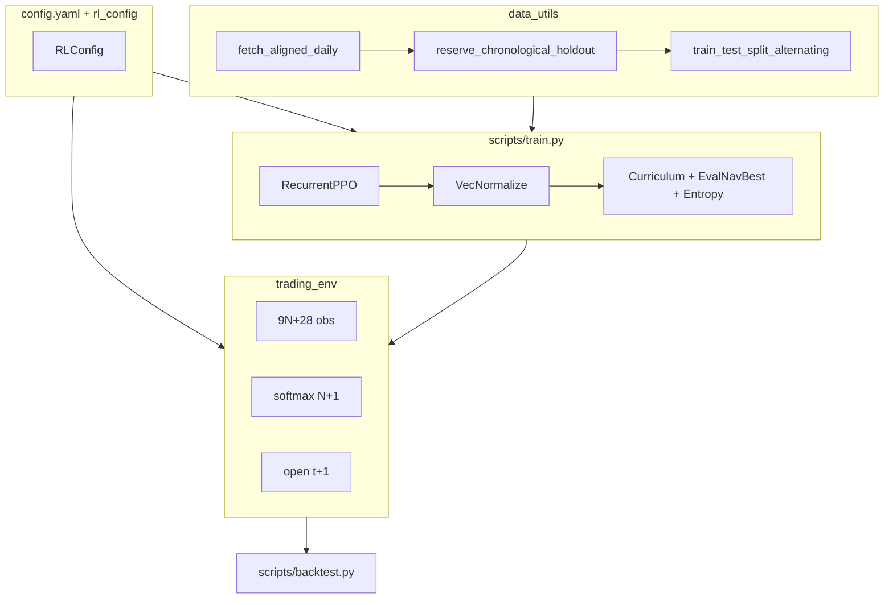

# MarketTrainer (RLBot)

Production research stack for training **RecurrentPPO** (LSTM) agents on a multi-asset daily portfolio environment, with strict chronological out-of-sample (OOS) holdouts and walk-forward in-training evaluation.

| Topic | Location |
|-------|----------|
| Hyperparameters, rewards, costs, curriculum | `config/config.yaml` → `rlbot/rl_config.py` |
| Universe size (5–55 assets), restart checklist | [docs/TRAINING.md](docs/TRAINING.md) |
| Config field reference | [config/README.md](config/README.md) |
| Methodology & run results | [RESEARCH.md](RESEARCH.md) |

Each training run writes under `Runs/<run_id>/` (manifest, config snapshot, models, plots, logs, TensorBoard). See `rlbot/run_artifacts.py`.

---

## Quick start

```bash
python -m venv .venv && source .venv/bin/activate
pip install -e ".[dev]"

# After universe or fetch changes (once)
python scripts/train.py --refresh-data --timesteps 1000 --run-id _data_refresh --no-viz

# Train (new --run-id per experiment)
python scripts/train.py --timesteps 65000000 --run-id my_run_001

# OOS backtest on chronological holdout (never seen in training)
python scripts/backtest.py --run-id my_run_001 --detailed --stochastic-paths 30 --plot-tag best
```

**CLI entry points** (after `pip install -e .`): `market-trainer-train`, `market-trainer-backtest`.

**Walk-forward example** (explicit dates + run id; calendars live in each run manifest):

```bash
python scripts/train.py --run-id W1 --timesteps 65000000 \
  --train-end 2015-12-31 --holdout-start 2016-01-01 --holdout-end 2017-12-31 --until 2017-12-31
python scripts/backtest.py --run-ids W1,W2,W3,W4,W5,W6 --checkpoint both
```

**Universe:** `N = len(universe.assets)` in config, or `python scripts/train.py --n-assets N` (first N YAML keys). Do not change core hyperparameters across walk-forward cohorts unless starting a new study.

Artifacts (gitignored): `Runs/`, `.cache/data_cache.npz`. Legacy roots (`models/`, `runs/`, …) are still read until you run `python scripts/migrate_runs_layout.py`.

First launch in a new terminal can take several minutes before PPO progress appears; see [docs/TRAINING.md#startup-time-first-run-in-a-session](docs/TRAINING.md#startup-time-first-run-in-a-session).

---

## Architecture



---

## Core design

### Data (`rlbot/data_utils.py`)

1. Fetch aligned daily OHLCV for `universe.assets` (yfinance).
2. Cache panel + `tickers` in `.cache/data_cache.npz`.
3. Reserve chronological OOS holdout before any in-training split.
4. Walk-forward alternating split (126-bar blocks; every 4th block eval).
5. Per-segment features (RSI, MACD, fracdiff, trend) with join purge — no cross-block leakage.

### Environment (`rlbot/trading_env.py`)

- **Action:** `N+1` logits → softmax → long-only risky weights, per-asset cap (`max_single_asset_weight`).
- **Observation:** `obs_dim = 9×N + 28` (four fixed macro series).
- **Execution:** decide after `close[t−obs_lag]`, fill `open[t+1]`, MTM `close[t+1]`.
- **Reward:** return + Sortino vs cap-weighted benchmark − inactivity − VIX-scaled churn − drawdown² (training curricula on fees/churn/DR).

### Training (`scripts/train.py`)

- **RecurrentPPO** `MlpLstmPolicy` (2×64 LSTM, MLP [128,128]), 8 parallel envs, 65M default timesteps.
- **EvalNavBestModelCallback** → `Runs/<run_id>/models/best/best_model.zip` (max mean in-training eval NAV).
- **TradingCurriculumCallback** — frictionless phase, fee ramp, progressive domain randomization.
- Checkpoint selection for published OOS: **eval-NAV-best only** (holdout never used to pick weights).

### Evaluation

| Script | Purpose |
|--------|---------|
| `scripts/backtest.py` | OOS rollout from `Runs/<id>/manifest.json`, benchmarks, plots |
| `scripts/run_seed_ensemble.sh` | Multi-seed training + ensemble backtest |
| `rlbot/baselines.py` | SPY B&H, equal-weight, 60/40, naive risk parity |

Passive benchmarks use **simple-return** cross-sectional aggregation, then compound (see `rlbot/baselines.py`).

---

## Walk-forward windows

| Window | Train through | OOS holdout | Train |
|--------|---------------|-------------|-------|
| 1 | 2015-12-31 | 2016–2017 | `--run-id W1` + dates in [RESEARCH.md](RESEARCH.md) |
| 2 | 2017-12-31 | 2018–2019 | `--run-id W2` |
| 3 | 2019-12-31 | 2020–H1 2021 | `--run-id W3` |
| 4 | 2021-06-30 | 2021 H2–2022 | `--run-id W4` |
| 5 | 2022-12-31 | 2023–2024 | `--run-id W5` |
| 6 | 2024-12-31 | 2025–latest | `--run-id W6` |

OOS: `python scripts/backtest.py --run-id W1 --checkpoint both --detailed`

---

## Project layout

| Path | Role |
|------|------|
| `config/config.yaml` | Universe, PPO, reward, costs |
| `rlbot/` | Library: data, env, config, artifacts, visualize, baselines |
| `scripts/` | `train.py`, `backtest.py`, `run_seed_ensemble.sh` |
| `docs/TRAINING.md` | Operations guide |
| `RESEARCH.md` | Methodology + completed-run results |
| `tests/` | `pytest` |
| `execution/` | Reserved for future broker integration |

---

## Dependencies

`gymnasium`, `stable-baselines3`, `sb3-contrib`, `torch`, `pandas`, `numpy`, `yfinance`, `matplotlib`, `tensorboard`, `PyYAML` — see `requirements.txt` / `pyproject.toml`.
